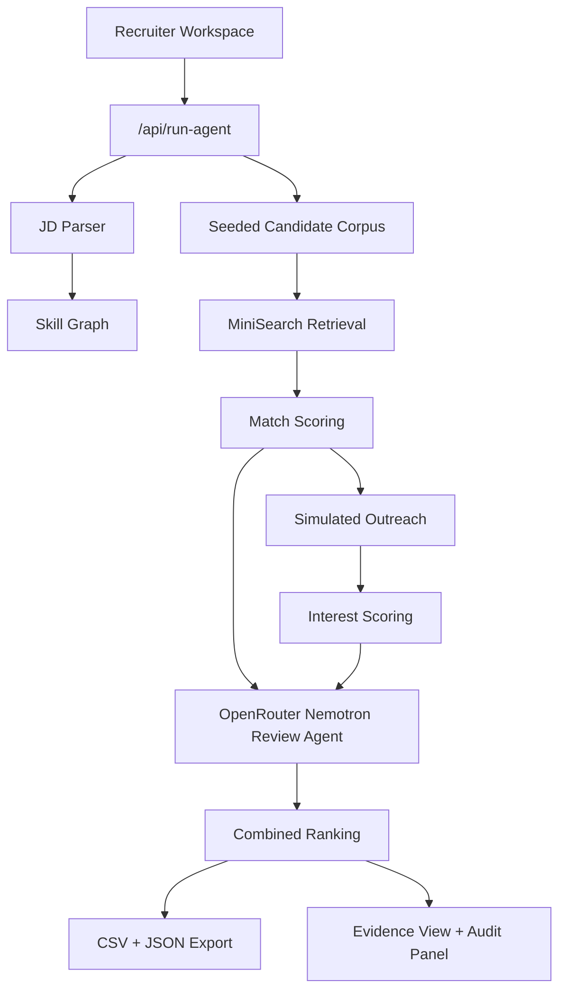

# Architecture

## Agent Flow

## Design Choices

- **Deterministic first**: the app can be judged and demoed without paid model calls.
- **Graph-informed scoring**: direct matches get strongest credit, adjacent skills get partial credit, and missing skills are visible.
- **Evidence-first UI**: every score is backed by factor text, requirement evidence rows, gaps, and a simulated transcript.
- **Budget-aware models**: Gemini and OpenRouter are tracked in the model budget ledger with per-minute and per-day guards.
- **Agentic review**: OpenRouter defaults to `nvidia/nemotron-3-super-120b-a12b:free` for one shortlist-review call per uncached run.

## Data Model

Main types live in `src/lib/types.ts`:

- `JDProfile`
- `CandidateProfile`
- `CandidateScore`
- `EvidencePath`
- `AgentRunResult`

## Candidate Discovery

The prototype uses a seeded fictional candidate corpus and optional JSON upload. Retrieval is powered by `MiniSearch` over candidate headline, domains, skills, and projects. This keeps the submission ethical and reproducible while still demonstrating discovery and ranking behavior.

## Knowledge Graph

The skill graph in `src/lib/skills.ts` stores:

- canonical skill labels
- aliases
- categories
- adjacent/transferable skill relationships

The UI renders a structured evidence view that maps each JD requirement to direct, adjacent, or missing candidate evidence. This keeps the explanation readable during a short demo and avoids a dense graph that recruiters have to decode.
