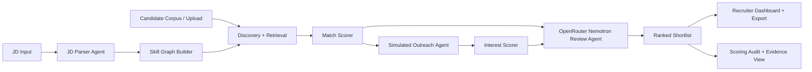

# Recruiter Agent Shortlist

An AI-agent web app that turns a pasted Job Description into a recruiter-ready candidate shortlist with two separate scores:

- **Match Score**: how well a candidate fits the JD based on skills, seniority, domain, location, adjacent skill graph paths, and constraints.
- **Interest Score**: how likely the candidate appears to engage, based on simulated outreach, motivation, timeline, objections, and fit signals.

The app is built as a working prototype for the abstract: JD parsing, candidate discovery, explainable matching, simulated conversational outreach, and a ranked output the recruiter can act on immediately.

## Local Setup

```powershell
npm.cmd install
npm.cmd run dev
```

Open [http://localhost:3000](http://localhost:3000).

Optional `.env.local`:

```env
GEMINI_API_KEY=your_key
GEMINI_MODEL=gemini-2.5-flash-lite
GEMINI_RATE_LIMIT_RPM=15
GEMINI_RATE_LIMIT_TPM=250000
GEMINI_RATE_LIMIT_RPD=500
GEMINI_TIMEOUT_MS=12000
OPENROUTER_API_KEY=your_key
OPENROUTER_MODEL=nvidia/nemotron-3-super-120b-a12b:free
OPENROUTER_RATE_LIMIT_RPM=20
OPENROUTER_RATE_LIMIT_RPD=50
OPENROUTER_TIMEOUT_MS=25000
```

The prototype works without keys using deterministic parsing, scoring, and simulated outreach.

## What It Does

- Parses a JD into role, seniority, domain, location, work mode, responsibilities, must-have skills, nice-to-have skills, and constraints.
- Discovers candidates from a seeded fictional talent corpus, with optional JSON upload for custom candidates.
- Builds an explainable skill graph inspired by ESCO, O*NET, and Lightcast-style taxonomies.
- Scores candidates using deterministic logic first, then model-backed agent review when keys are available.
- Simulates candidate outreach and generates Interest Score evidence.
- Shows a ranked shortlist, structured evidence view, simulated transcript, scoring audit, CSV export, and JSON export.

## Architecture



Primary files:

- `src/lib/parser.ts`: deterministic JD parser and schema fallback.
- `src/lib/scoring.ts`: discovery, match scoring, ranking, evidence paths.
- `src/lib/outreach.ts`: simulated outreach and interest scoring.
- `src/lib/agent.ts`: orchestration, cache, graph generation, exports.
- `src/components/RecruiterWorkspace.tsx`: recruiter dashboard.

## API

- `POST /api/run-agent`
  - Body: `{ "jdText": "...", "searchMode": "seeded", "weights": { "match": 60, "interest": 40 } }`
  - Returns: full ranked run with JD profile, shortlist, graph, budget ledger, CSV, and JSON export.
- `POST /api/parse-jd`
  - Body: `{ "jdText": "..." }`
  - Returns: structured JD profile.
- `POST /api/outreach/simulate`
  - Body: `{ "jdText": "...", "candidateId": "maya-shah" }`
  - Returns: simulated transcript and interest factors.
- `GET /api/samples`
  - Returns: sample JDs and expected sample output metadata.

## Scoring Logic

Match Score is 0-100:

- 35% skill coverage
- 15% skill depth
- 15% seniority/role fit
- 10% domain/project relevance
- 10% location/work-mode fit
- 10% adjacent/transferable graph skills
- 5% availability/compensation fit

Interest Score is 0-100:

- Openness
- Timeline
- Role motivation
- Compensation fit
- Location/work-mode fit
- Objection risk
- Response specificity

Default combined ranking:

```text
combinedScore = 0.6 * matchScore + 0.4 * interestScore
```

## Model Budgeting

The app is designed to respect limited free model quotas:

- Deterministic scoring runs first.
- Gemini is used for structured JD parsing when `GEMINI_API_KEY` is present. Gemini Model is set to Gemini 3.1 flash lite for faster inference and higher rate limits in free API from Google AI Studio.
- OpenRouter uses `nvidia/nemotron-3-super-120b-a12b:free` by default for one shortlist-review agent call per uncached run. I chose this due to it's speed from nvidia provider while being very high reasoning agent.
- Runs are cached by JD and weighting hash in memory during a dev session.
- The response includes a `modelBudget` ledger with call counts and fallback notes.
- Default guardrails are set for the limits you described: Gemini 15 RPM / 250k TPM / 500 RPD and OpenRouter free 20 RPM / 50 RPD. These can be changed through env vars.
- Model calls have hard timeouts by default: Gemini 12 seconds and OpenRouter 25 seconds. If a provider is slow, deterministic scoring still returns a usable shortlist.

## AI Agent Workflow

1. **JD Parser Agent**: Gemini extracts structured JD fields into the app schema. The deterministic parser validates and backs this up.
2. **Discovery Agent**: MiniSearch retrieves candidates from the fictional corpus or uploaded JSON, then the skill graph expands direct matches with adjacent skills.
3. **Match Scorer Agent**: deterministic scoring computes Match Score with auditable factor weights.
4. **Outreach Simulator Agent**: candidate personas generate simulated conversation turns for Interest Score.
5. **Shortlist Review Agent**: OpenRouter Nemotron reviews the top shortlist in one call and adds recruiter notes, outreach angles, risk flags, and suggested actions.

## Safety And Fairness

- The seeded corpus is fictional.
- Protected attributes are not part of scoring.
- Outreach is clearly marked as simulated.
- The app is decision support for recruiters, not an automated rejection system.
- The audit panel records score factors, evidence paths, and fallback behavior.


## Research anchors used during planning:

- [ESCO](https://employment-social-affairs.ec.europa.eu/policies-and-activities/skills-and-qualifications/skills-jobs/european-skillscompetences-qualifications-and-occupations-esco_en)
- [O*NET Web Services](https://services.onetcenter.org/about)
- [Lightcast Skills Taxonomy](https://kb.lightcast.io/en/articles/7216059-lightcast-skills-taxonomy)
- [Graph Neural Networks for Candidate-Job Matching](https://link.springer.com/article/10.1007/s41019-025-00293-y)
- [Gemini Grounding](https://ai.google.dev/gemini-api/docs/google-search)
- [Gemini Structured Outputs](https://ai.google.dev/gemini-api/docs/structured-output)
- [OpenRouter Limits](https://openrouter.ai/docs/api/reference/limits)
- [NIST AI RMF](https://www.nist.gov/itl/ai-risk-management-framework)
- [EEOC Selection Guidance](https://www.eeoc.gov/laws/guidance/employment-tests-and-selection-procedures)
- [DOL Inclusive Hiring Framework](https://www.dol.gov/newsroom/releases/odep/odep20240924)


## Tests

```powershell
npm.cmd run test
npm.cmd run build
npm.cmd run e2e:install
npm.cmd run e2e
```
