# Recruiter Agent: Approach and Trade Offs

## Problem And Abstract Fit

Recruiters lose time screening profiles and chasing candidate interest. This prototype takes a Job Description as input, discovers matching fictional candidates, simulates conversational outreach, and returns a ranked shortlist with separate **Match Score** and **Interest Score** so the recruiter can act immediately.

## Approach

The app uses an agent pipeline:

1. **JD Parser Agent**: Gemini extracts role, seniority, location, work mode, responsibilities, must-have skills, nice-to-have skills, and constraints. A deterministic parser validates and backs it up.
2. **Candidate Discovery Agent**: MiniSearch retrieves candidates from a seeded fictional corpus or uploaded JSON candidate data.
3. **Skill Graph Matcher**: A lightweight taxonomy inspired by ESCO/O*NET/Lightcast maps aliases and adjacent skills for explainability.
4. **Match Scorer**: Deterministic scoring assigns Match Score using skill coverage, depth, seniority, domain, location/work mode, adjacent skills, and compensation/availability.
5. **Outreach Simulator + Interest Scorer**: Candidate personas simulate a short conversation and score openness, timeline, motivation, compensation fit, work mode fit, objections, and specificity.
6. **Shortlist Review Agent**: OpenRouter `nvidia/nemotron-3-super-120b-a12b:free` reviews the shortlist and adds recruiter notes, outreach angles, risk flags, and suggested actions.

## Architecture

```mermaid
flowchart LR
  JD["JD Input"] --> Parse["Gemini JD Parser"]
  Parse --> Discover["Candidate Discovery"]
  Discover --> Match["Skill Graph Match Score"]
  Match --> Outreach["Simulated Outreach"]
  Outreach --> Interest["Interest Score"]
  Interest --> Review["Nemotron Review Agent"]
  Review --> Rank["Ranked Shortlist"]
  Rank --> Export["CSV/JSON + Audit"]
```

## Trade-Offs

- Uses a fictional local corpus rather than scraping real profiles, making the prototype ethical and reproducible.
- Deterministic scoring is kept as the source of truth for stability; LLMs enhance parsing and recruiter-facing review.
- Model calls are rate-guarded and timeout-bounded: Gemini defaults to 15 RPM / 250k TPM / 500 RPD with a 12s timeout, and OpenRouter free defaults to 20 RPM / 50 RPD with a 25s timeout.
- The evidence view is intentionally table-like instead of a dense graph so recruiters and judges can quickly understand why a candidate ranked where they did.

